# deploy_app_2_eks
Deploying a Python Application to EKS uisng Jenkins and GitOps pipelin


The CICD pipeline starts with creating Jenkins server and installing jenkins. Also install a;; the necessary plugins such as EC2 plugins, github plugins, docker plugins, Parameterized trigger Plugin,  GitHub Integration Plugin and so on.  . 

Next, configure EC2 as Jenkins agent. Under manage jenkins, head to manage clouds, configure clouds and fill in all the necessary information.

## Add Credentials
For jenkins to communicate with other services such as github and docker, it needs credentials. Head to manage jenkins, manage credentials, and add the required credentials. 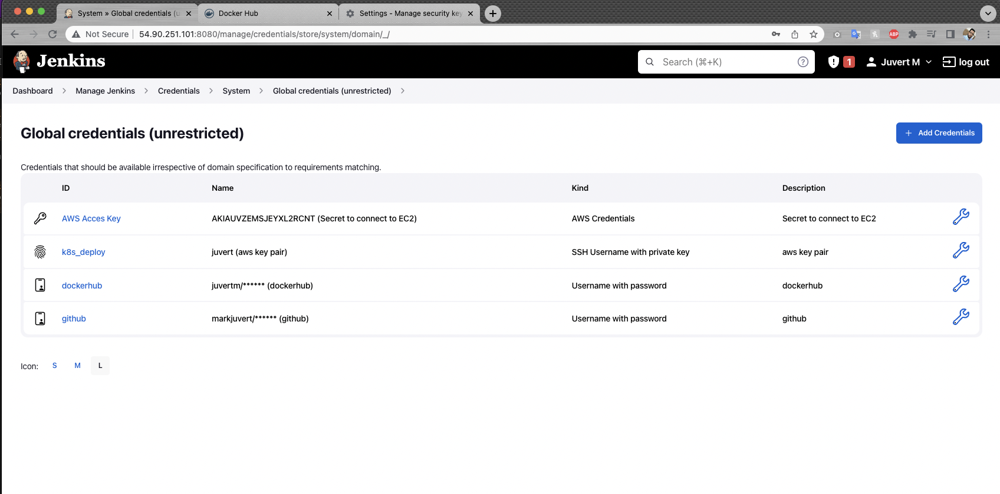.

## Creating the pipeline in Jenkins

In Jenkins, click on new item, enter the name of the pipeline, select pipeline below and click on okay. The next page is the configure page. Scroll down to the pipeline section and select pipeline script from SCM, select Git as the SCM, head to github and copy the repo link and paste it in the repository URL field. IF the repo is a private repo, do add github credentials.
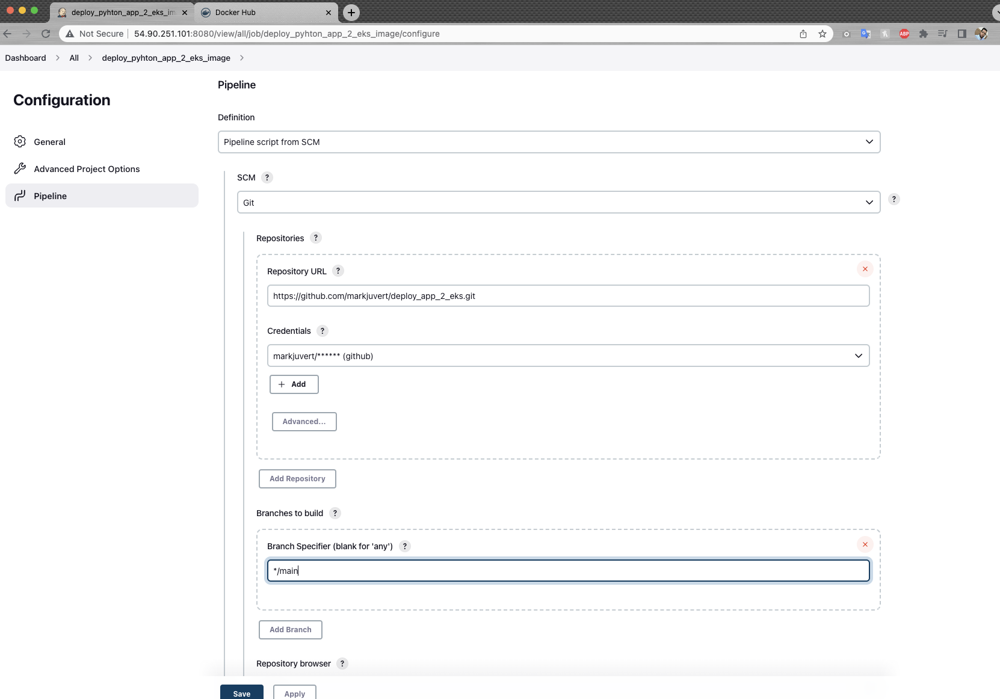.


## Adding Files to Github Repo
In this step, code and commit all the necessary files to the github repo.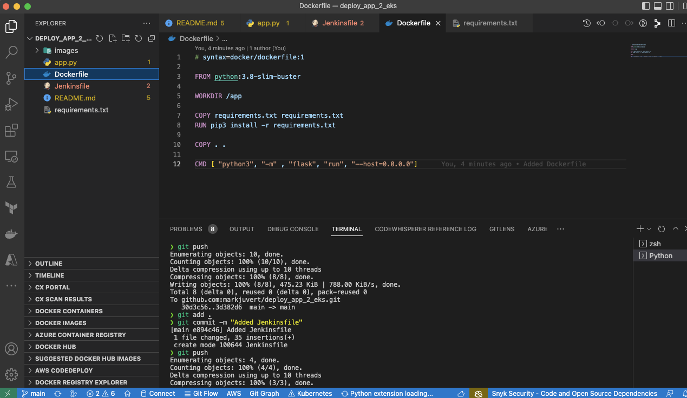.


## Adding Update Manifest Job

Head to Jenkins, new item, enter the name of the manifest. In this case, it's the name specified in the trigger stage in the Jenkinsfile. The name should match the build image job for it to be updated. 
In the next page, select this project is parameterized, select add a string parameter and enter the details as shown in the screenshot. Scroll below to the pipeline section and add pipeline from SCM, select Git and enter the github repo containing the deployment manifest file.

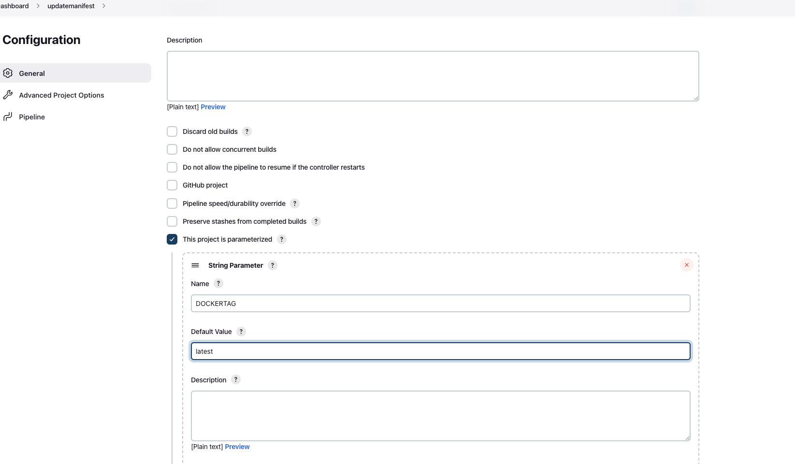.


## Building the image

Head to Jenkins dashboard and select the image job, in this case deploy_pyhton_app_2_eks_image and click on build now.
The pipeline will clone the repository, build the image, test the image, push the image to dockerhub and update the manifest file. 
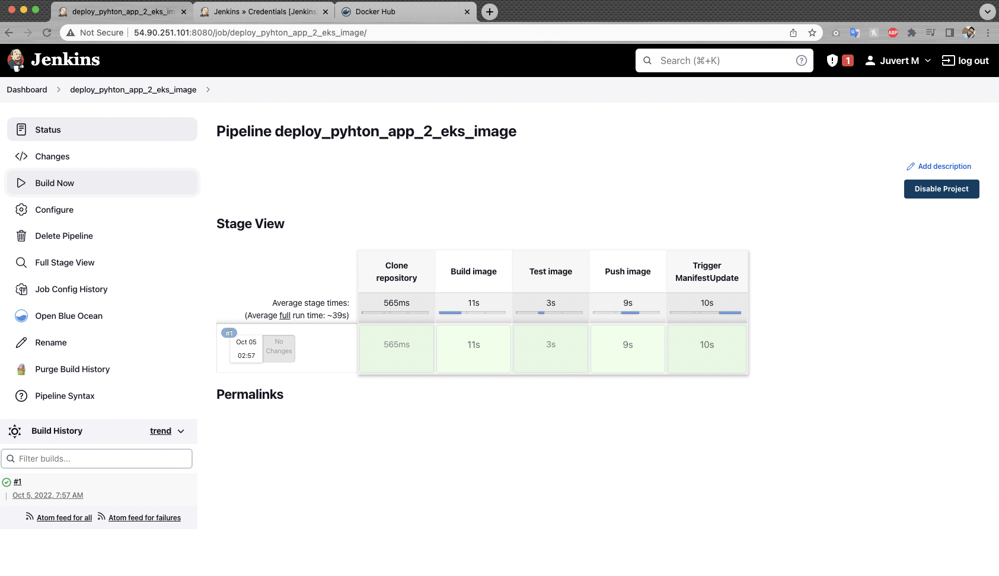.

The console output image tag will change from latest to tag 1 as shown in the screeenshot.
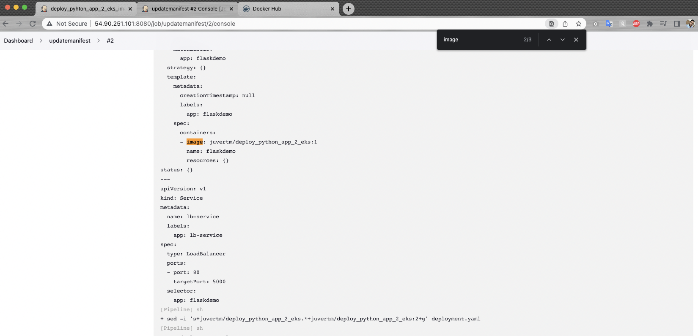.

The newly created image can be seen in the dockerhub repo with the tags updated and the time it updated.
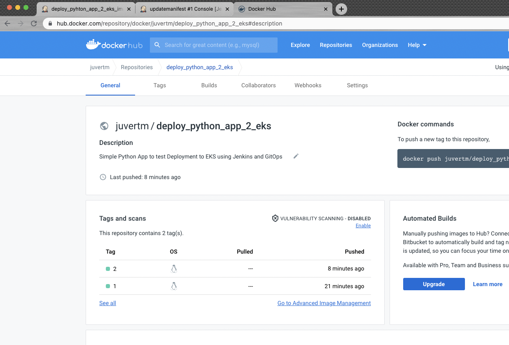


## Creating an EKS Cluster

There are many methods of creating an EKS cluster. It can be created using the eksctl command, AWS management console, AWS CLI, IAC and other management tools.

In this demo, a simple EKS cluster is created using the eksctl command. Modify the command below specifying the name of the cluster, regio code, version, and networking tools.
'''
eksctl create cluster --name my-cluster --region region-code --version 1.23 --vpc-private-subnets subnet-ExampleID1,subnet-ExampleID2 --without-nodegroup
'''
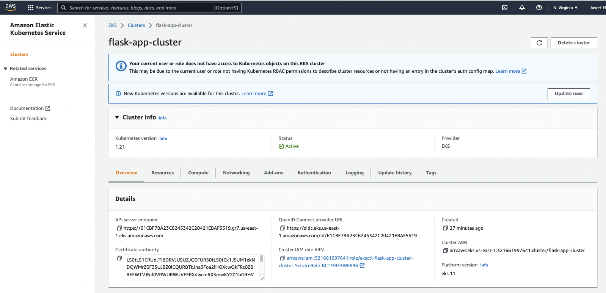.


## Installing Argo CD

Argo CD is a declarative, GitOps continuous delivery tool for Kubernetes. 
In this demo, Argo CD will be installed using the eksctl commands.

### Install Argo CD

First, create a namespace and add the install yaml files.
'''
kubectl create namespace argocd
kubectl apply -n argocd -f https://raw.githubusercontent.com/argoproj/argo-cd/stable/manifests/install.yaml
'''
The next, download the argocd using homebrew or CLI installation method.

Continue setup later


## Configuring the Application on argocd.

Head to argocd dashboard using localhost:8080 and click on new app, enter the name of the application as in the deployment.yaml file (in this case, flaskdemo), project default, sync policy as automatic so that argocd can check the state of the cluster automatically. 
Copy the repository URL hosting the deployment.yaml manifest file and add in the git repository URL field. Also, enter the cluster URL and namespace. Click on create. 
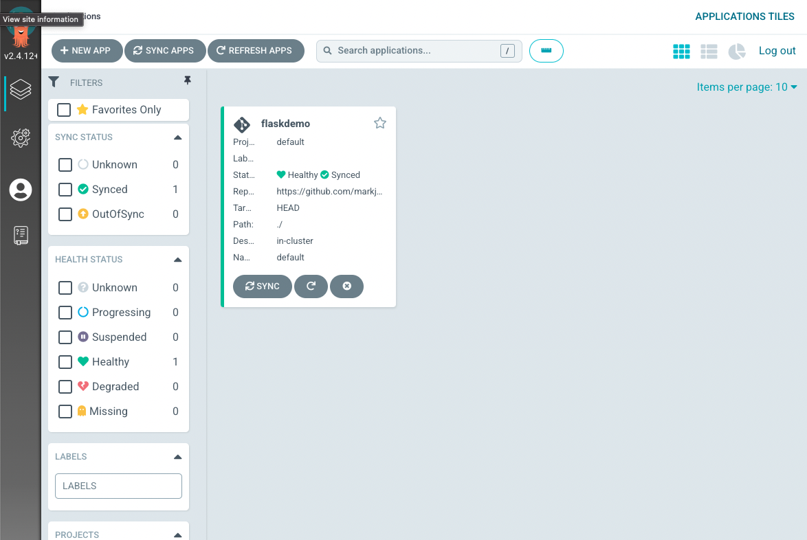.

Argo Cd creates a load balancer service and deploy the application to the cluster, create the number of replicas specified in the yaml file, check the health of the application and sync with the application. 
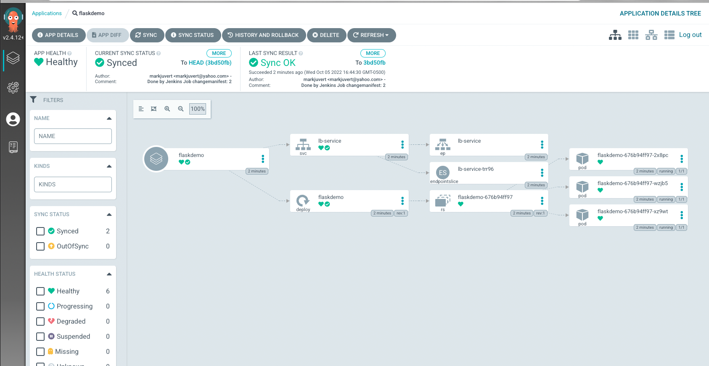

Kubectl get pods shows the pods running. 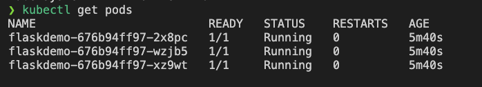.
Inorder to get the load balancer url, use the command
```
 kubectl get svc
 ```
  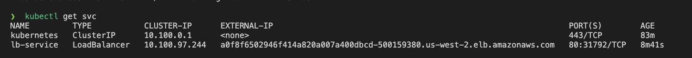.

  In order to access the application, Copy the external Ip of the load balancer service, open a new browser tap and paste it in. There we can see the application.
    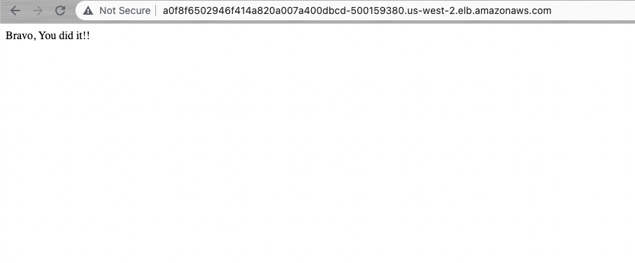.

